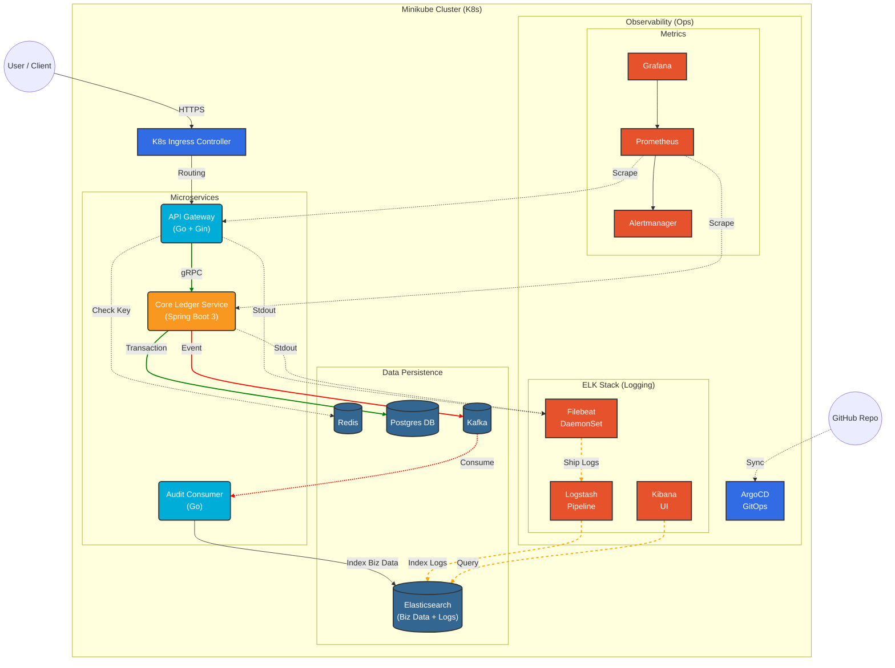
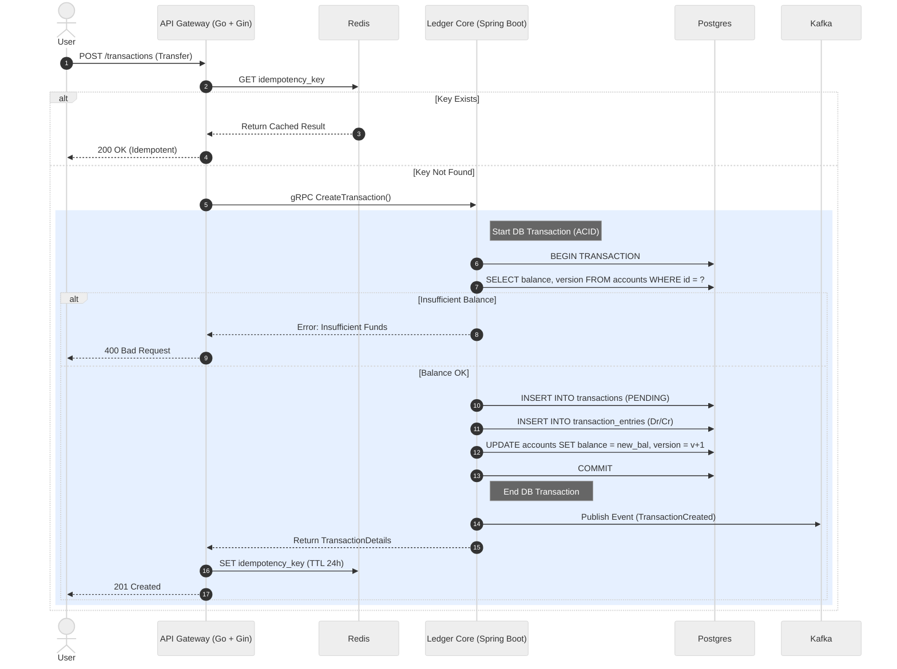
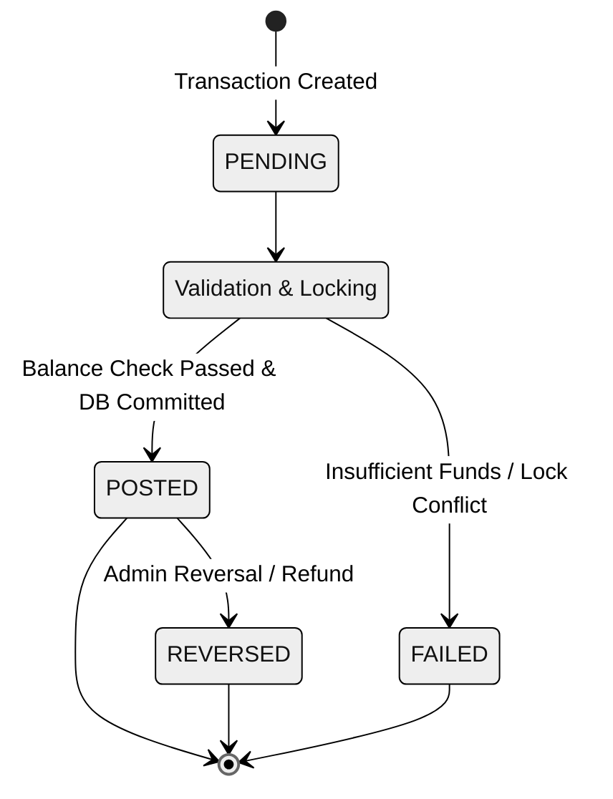
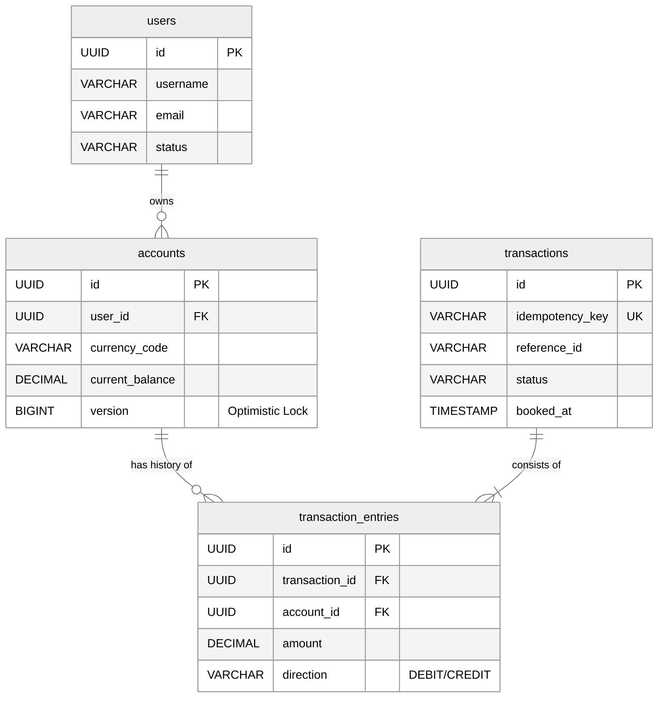

# Distributed Fintech Ledger System

A high-performance, double-entry bookkeeping ledger system built with a **Microservices Architecture**. This project simulates a real-world banking environment, focusing on data consistency (ACID), high concurrency, centralized logging, and event-driven design patterns (CQRS).

## 🚀 Project Overview

This system allows for the secure processing of financial transactions using the **Double-Entry** principle. It decouples the "Write" path (Core Ledger) from the "Read" path (Audit/Search) and implements full observability stack.

**Key Features:**
* **Double-Entry Accounting:** Ensures `Sum(Debits) == Sum(Credits)` for every transaction.
* **Polyglot Microservices:** Combines **Java 21 (Virtual Threads)** for core logic and **Go** for high-performance edge services.
* **Event Sourcing:** Uses **Kafka** to maintain an immutable log of state changes.
* **CQRS Pattern:** Separates write operations (Postgres) from complex search queries (Elasticsearch).
* **Centralized Logging:** Automated log collection using **Filebeat**, processing via **Logstash**, and visualization in **Kibana**.
* **GitOps:** Fully automated deployment using ArgoCD and Kubernetes.

## 🛠 Tech Stack

| Category | Technology | Usage |
| :--- | :--- | :--- |
| **Languages** | **Java 21 (Spring Boot 3)** | Core Ledger (Virtual Threads, Decimal precision) |
| | **Go (Gin Framework)** | API Gateway, Audit Consumers |
| **Communication** | **gRPC** | Internal high-performance service-to-service calls |
| | **Kafka** | Asynchronous Event Streaming |
| **Storage** | **PostgreSQL** | Primary Relational DB (ACID Compliance) |
| | **Redis** | Caching & Idempotency Keys |
| | **Elasticsearch** | Search Engine (Transaction History) & Log Store |
| **Observability** | **Filebeat** | Lightweight Log Shipper (DaemonSet) |
| | **Logstash** | Log Processing Pipeline |
| | **Kibana** | Log Analysis & Visualization Dashboard |
| | **Prometheus & Grafana** | Metrics Scraping & Visualization |
| **Infrastructure** | **Kubernetes (Minikube)** | Container Orchestration |
| | **ArgoCD** | GitOps Continuous Delivery |

## 🏗 System Architecture

The diagram below illustrates the comprehensive data flow, including the **ELK Stack** for logging and **Prometheus** for metrics.

## 🔄 Transaction Flow (Sequence Diagram)

This diagram details the life-cycle of a transfer request, highlighting the **Idempotency check** and **ACID Transaction** boundaries.

## 🚦 Transaction State Machine

In a distributed system, managing the state of a transaction is critical. We use a definite state machine to ensure traceability.

## 💾 Database Schema (ERD)

The database design prioritizes **ACID compliance** and **Auditability**. We use a strict Double-Entry bookkeeping model where every transaction entry is immutable.

**Key Design Decisions:**
* **Immutable Entries:** `transaction_entries` are append-only. No updates allowed.
* **Optimistic Locking:** The `accounts` table uses a `version` column to handle high concurrency and prevent race conditions.
* **Idempotency:** Unique constraints on `idempotency_key` prevent double-spending at the database level.

## ⚡️ Getting Started

### Prerequisites
* Docker & Docker Compose
* Minikube (16GB RAM recommended for full stack)
* Java 21+ & Go 1.21+

## ⚠️ Disclaimer

This project is for **educational purposes only**. It is a simulation of a distributed ledger system and is **not intended for use in production environments** handling real financial data. The author assumes no responsibility for any financial losses or data corruption resulting from the use of this software.