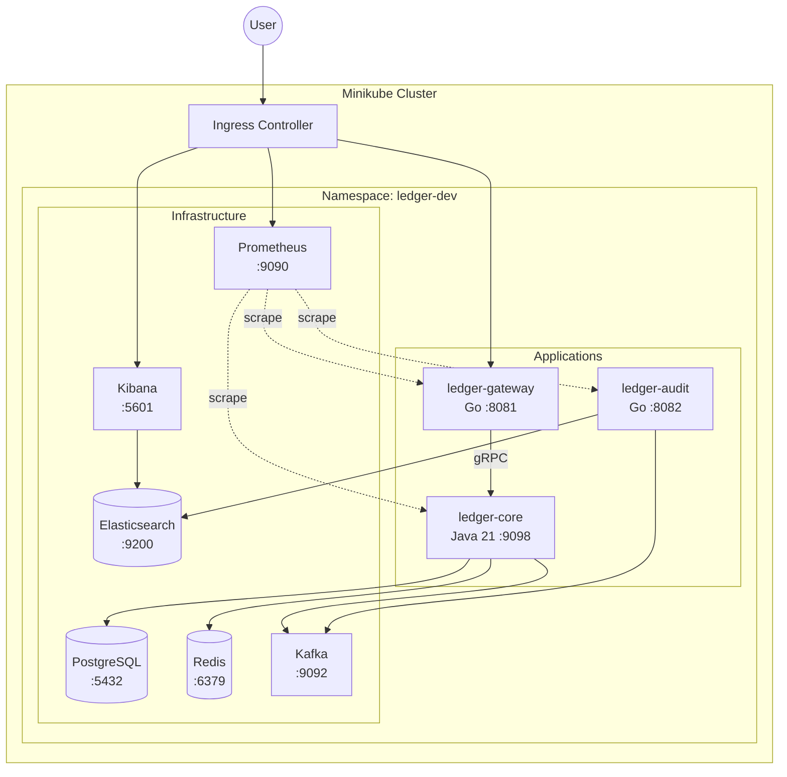
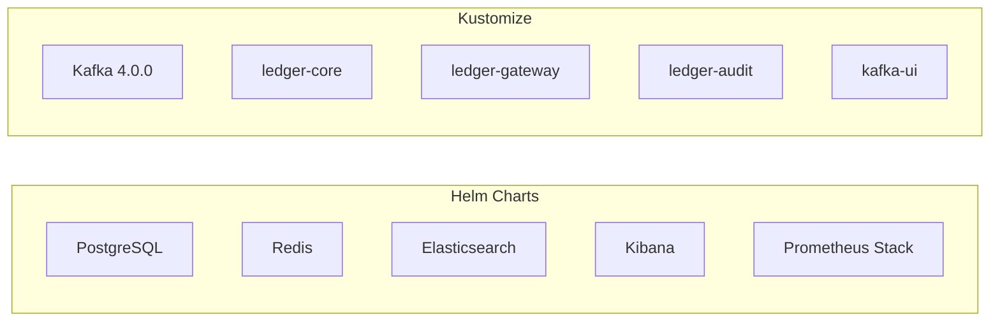
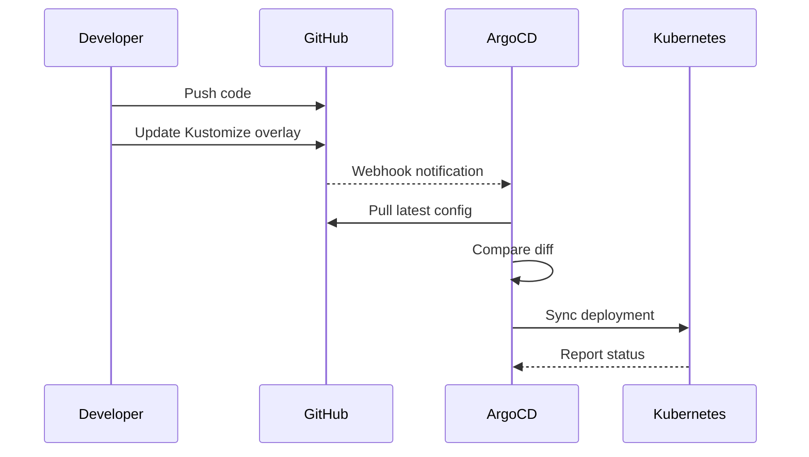
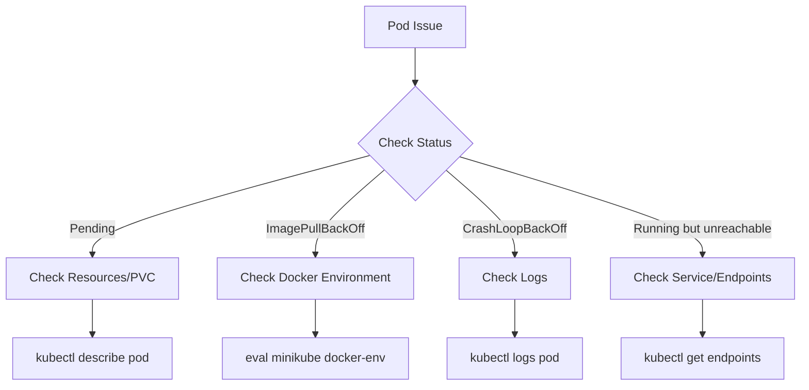

# Kubernetes Deployment Guide

This guide explains how to deploy the Double-Entry-Ledger microservices to Minikube (local Kubernetes cluster).

## Table of Contents

- [Architecture Overview](#architecture-overview)
- [Prerequisites](#prerequisites)
- [Quick Start](#quick-start)
- [Detailed Deployment Steps](#detailed-deployment-steps)
- [Accessing Services](#accessing-services)
- [ArgoCD GitOps](#argocd-gitops)
- [Troubleshooting](#troubleshooting)

---

## Architecture Overview



### Deployment Methods



### Technology Stack

| Category | Technology | Description |
|----------|------------|-------------|
| **Orchestration** | Kubernetes (Minikube) | Local development environment |
| **Package Management** | Helm 3 | Infrastructure services management |
| **Configuration** | Kustomize | Base/overlay structure for apps |
| **GitOps** | ArgoCD | Automated deployment & sync |
| **Message Queue** | Apache Kafka 4.0.0 | KRaft mode (no Zookeeper) |
| **Database** | PostgreSQL 18 | Bitnami Helm Chart |
| **Cache** | Redis 8 | Bitnami Helm Chart |
| **Search Engine** | Elasticsearch 8.11 | Elastic Helm Chart |
| **Monitoring** | Prometheus | kube-prometheus-stack (minimal) |

---

## Prerequisites

### Hardware Requirements

| Item | Minimum | Recommended |
|------|---------|-------------|
| RAM | 16 GB | 20 GB+ |
| CPU | 4 cores | 6 cores+ |
| Disk | 50 GB | 100 GB |

### Software Requirements

| Software | Version | Installation Link |
|----------|---------|-------------------|
| Docker Desktop | Latest | [Download](https://www.docker.com/products/docker-desktop/) |
| Minikube | v1.32+ | [Download](https://minikube.sigs.k8s.io/docs/start/) |
| kubectl | v1.28+ | [Download](https://kubernetes.io/docs/tasks/tools/) |
| Helm | v3.12+ | [Download](https://helm.sh/docs/intro/install/) |

### Platform-Specific Notes

#### Windows 11

| Topic | Details |
|-------|---------|
| **Shell** | Use **PowerShell** (not CMD) for most commands |
| **Line continuation** | Use backtick (`` ` ``) instead of backslash (`\`) |
| **Network Access** | **Must** run `minikube tunnel` in a separate **Administrator** terminal |
| **Ingress IP** | Use **`127.0.0.1`** (via tunnel), **NOT** `minikube ip` |
| **curl** | Use `curl.exe` to avoid PowerShell alias issues |
| **JSON in curl** | Use escaped double quotes or variables (see [Testing API](#testing-api)) |
| **Hosts file** | Edit as Administrator: `C:\Windows\System32\drivers\etc\hosts` |
| **Docker env** | `minikube docker-env \| Invoke-Expression` |

#### Linux/macOS

| Topic | Details |
|-------|---------|
| **Shell** | Any terminal emulator with Bash |
| **Line continuation** | Use backslash (`\`) |
| **Network Access** | `minikube tunnel` is optional; `minikube ip` works natively |
| **Ingress IP** | Use output of **`minikube ip`** |
| **curl** | Standard `curl` command |
| **JSON in curl** | Use single quotes (`'`) for JSON bodies |
| **Hosts file** | Edit with `sudo`: `/etc/hosts` |
| **Docker env** | `eval $(minikube docker-env)` |

---

## Quick Start

### Linux/macOS

```bash
# 1. Start Minikube
minikube start --cpus 4 --memory 12288 --driver=docker

# 2. Enable Ingress
minikube addons enable ingress

# 3. Configure Docker environment (Important! Run for each new terminal)
eval $(minikube docker-env)

# 4. Create Namespace and Secrets
kubectl apply -f deploy/k8s/infra/namespace.yaml
kubectl apply -f deploy/k8s/secrets/secrets.yaml

# 5. Install Infrastructure (Prometheus first for CRDs)
helm install prometheus prometheus-community/kube-prometheus-stack \
  -f deploy/k8s/infra/helm-values/prometheus-values.yaml -n ledger-dev
helm install postgresql oci://registry-1.docker.io/bitnamicharts/postgresql \
  -f deploy/k8s/infra/helm-values/postgresql-values.yaml -n ledger-dev
helm install redis oci://registry-1.docker.io/bitnamicharts/redis \
  -f deploy/k8s/infra/helm-values/redis-values.yaml -n ledger-dev
kubectl apply -k deploy/k8s/infra/kafka
helm install elasticsearch elastic/elasticsearch \
  -f deploy/k8s/infra/helm-values/es-dev-values.yaml -n ledger-dev

# 6. Verify Installation
kubectl get pods -n ledger-dev
```

### Windows 11 (PowerShell)

```powershell
# 1. Start Minikube
minikube start --cpus 4 --memory 12288 --driver=docker

# 2. Enable Ingress
minikube addons enable ingress

# 3. Configure Docker environment (Important! Run for each new terminal)
minikube docker-env | Invoke-Expression

# 4. Create Namespace and Secrets
kubectl apply -f deploy/k8s/infra/namespace.yaml
kubectl apply -f deploy/k8s/secrets/secrets.yaml

# 5. Install Infrastructure (Prometheus first for CRDs)
helm install prometheus prometheus-community/kube-prometheus-stack `
  -f deploy/k8s/infra/helm-values/prometheus-values.yaml -n ledger-dev
helm install postgresql oci://registry-1.docker.io/bitnamicharts/postgresql `
  -f deploy/k8s/infra/helm-values/postgresql-values.yaml -n ledger-dev
helm install redis oci://registry-1.docker.io/bitnamicharts/redis `
  -f deploy/k8s/infra/helm-values/redis-values.yaml -n ledger-dev
kubectl apply -k deploy/k8s/infra/kafka
helm install elasticsearch elastic/elasticsearch `
  -f deploy/k8s/infra/helm-values/es-dev-values.yaml -n ledger-dev

# 6. Verify Installation
kubectl get pods -n ledger-dev
```

> **Windows Note**: Use backtick (`` ` ``) for line continuation instead of backslash (`\`)

---

## Detailed Deployment Steps

### Step 1: Start Minikube

```bash
# Start with resource configuration
minikube start --cpus 4 --memory 12288 --driver=docker

# Verify status
minikube status

# Enable required addons
minikube addons enable ingress
minikube addons enable metrics-server  # Optional, for resource monitoring
```

### Step 1.1: Configure Ingress for Windows (Windows Only)

On Windows with Minikube's Docker driver, `minikube ip` returns an IP that is not directly accessible. You must use `minikube tunnel` to expose services, which requires the Ingress controller to be of type `LoadBalancer`.

**Windows (PowerShell as Administrator):**

```powershell
# 1. Patch ingress-nginx-controller to LoadBalancer type
kubectl patch svc ingress-nginx-controller -n ingress-nginx `
  --type='json' `
  -p='[{"op": "replace", "path": "/spec/type", "value":"LoadBalancer"}]'

# 2. Start minikube tunnel in a SEPARATE Administrator PowerShell (keep it running)
minikube tunnel
```

> **Important**: The `minikube tunnel` command must remain running in a separate terminal window. It requires Administrator privileges.

**Linux/macOS:**

No patch is needed. The default `NodePort` type works with `minikube ip`. If you prefer to use `minikube tunnel`, you can apply the same patch.

### Step 2: Configure Docker Environment

**Linux/macOS:**
```bash
eval $(minikube docker-env)

# Verify (should show minikube)
docker info | grep "Name:"
```

**Windows (PowerShell):**
```powershell
minikube docker-env | Invoke-Expression

# Verify (should show minikube)
docker info | findstr "Name:"
```

> **Note**: You need to run this command each time you open a new terminal

> **Alternative for Windows**: If images are built on Docker Desktop separately, load them into Minikube:
> ```powershell
> minikube image load ledger-core:local
> minikube image load ledger-gateway:local
> minikube image load ledger-audit:local
> ```

### Step 3: Create Namespace and Secrets

```bash
# Create namespace
kubectl apply -f deploy/k8s/infra/namespace.yaml

# Create secrets (contains database passwords and other sensitive info)
kubectl apply -f deploy/k8s/secrets/secrets.yaml

# Verify
kubectl get ns ledger-dev
kubectl get secrets -n ledger-dev
```

> **Production Note**: The provided `secrets.yaml` contains plain Base64-encoded passwords suitable for development only. For production, use [Sealed Secrets](https://github.com/bitnami-labs/sealed-secrets) or [External Secrets Operator](https://external-secrets.io/) to manage secrets securely.

### Step 4: Install Infrastructure Services

#### 4.1 Add Helm Repos

```bash
helm repo add bitnami https://charts.bitnami.com/bitnami
helm repo add elastic https://helm.elastic.co
helm repo add prometheus-community https://prometheus-community.github.io/helm-charts
helm repo update
```

#### 4.2 Install Prometheus (First - provides CRDs for ServiceMonitor)

```bash
helm install prometheus prometheus-community/kube-prometheus-stack \
  -f deploy/k8s/infra/helm-values/prometheus-values.yaml \
  -n ledger-dev

# Wait for ready
kubectl wait --for=condition=ready pod -l app.kubernetes.io/name=prometheus \
  -n ledger-dev --timeout=300s
```

> **Important**: Install Prometheus first because it provides the `ServiceMonitor` CRDs that other Helm charts (PostgreSQL, Redis) may require

#### 4.3 Install PostgreSQL

```bash
helm install postgresql oci://registry-1.docker.io/bitnamicharts/postgresql \
  -f deploy/k8s/infra/helm-values/postgresql-values.yaml \
  -n ledger-dev

# Wait for ready
kubectl wait --for=condition=ready pod -l app.kubernetes.io/instance=postgresql \
  -n ledger-dev --timeout=300s
```

#### 4.4 Install Redis

```bash
helm install redis oci://registry-1.docker.io/bitnamicharts/redis \
  -f deploy/k8s/infra/helm-values/redis-values.yaml \
  -n ledger-dev

# Wait for ready
kubectl wait --for=condition=ready pod -l app.kubernetes.io/instance=redis \
  -n ledger-dev --timeout=300s
```

#### 4.5 Install Kafka

Deploy Apache Kafka 4.0.0 (KRaft mode) using custom Kustomize manifests:

```bash
kubectl apply -k deploy/k8s/infra/kafka

# Wait for ready
kubectl wait --for=condition=ready pod -l app=kafka \
  -n ledger-dev --timeout=300s
```

> **Note**: We use the official Apache `apache/kafka:4.0.0` image since Bitnami Kafka images may not be available from Docker Hub

#### 4.6 Install Elasticsearch

```bash
helm install elasticsearch elastic/elasticsearch \
  -f deploy/k8s/infra/helm-values/es-dev-values.yaml \
  -n ledger-dev

# Wait for ready (Elasticsearch takes longer to start)
kubectl wait --for=condition=ready pod/elasticsearch-master-0 \
  -n ledger-dev --timeout=600s
```

> **Note**: Elasticsearch is deployed with security enabled (HTTPS + Basic Auth). The `ledger-audit` service automatically reads credentials from the `elasticsearch-master-credentials` secret.

### Step 5: Build and Deploy Applications

#### 5.1 Build Docker Images

> **Important**: All Dockerfiles are designed to be built from the **project root directory**. The build context must be `.` (current directory = project root), not the individual app directories.

```bash
# Make sure you're in the project root directory
cd /path/to/double-entry-ledger

# Build all services (note: build context is "." = project root)
docker build -t ledger-core:local -f apps/core/Dockerfile .
docker build -t ledger-gateway:local -f apps/gateway/Dockerfile .
docker build -t ledger-audit:local -f apps/audit/Dockerfile .

# Verify
# Linux/macOS:
docker images | grep ledger
# Windows (PowerShell):
docker images | findstr ledger
```

> **Common Mistake**: Do NOT run `cd apps/gateway && docker build .` - this will fail because the Dockerfile expects the build context to include `api/proto` directory which is at project root level.

#### 5.2 Deploy Microservices (Kustomize)

```bash
# Deploy core services
kubectl apply -k deploy/k8s/apps/ledger-core/overlays/dev
kubectl apply -k deploy/k8s/apps/ledger-gateway/overlays/dev
kubectl apply -k deploy/k8s/apps/ledger-audit/overlays/dev

# Deploy Kafka UI (optional)
kubectl apply -k deploy/k8s/apps/kafka-ui/overlays/dev

# Deploy Ingress
kubectl apply -f deploy/k8s/ingress/ingress.yaml
```

### Step 6: Configure Local DNS

#### Windows 11

On Windows, the Ingress is accessed via `minikube tunnel` at **`127.0.0.1`**.

**Option 1: Manual Edit (Recommended)**
1. Open Notepad as **Administrator**
2. Open file: `C:\Windows\System32\drivers\etc\hosts`
3. Add the following line:
   ```
   127.0.0.1 api.ledger.local kafka.ledger.local kibana.ledger.local prometheus.ledger.local
   ```
4. Save file

**Option 2: Command Line (CMD as Administrator)**
```cmd
echo 127.0.0.1 api.ledger.local kafka.ledger.local kibana.ledger.local prometheus.ledger.local >> C:\Windows\System32\drivers\etc\hosts
```

#### Linux/macOS

On Linux/macOS, use the output of `minikube ip`.

```bash
# Get Minikube IP
MINIKUBE_IP=$(minikube ip)
echo "Minikube IP: $MINIKUBE_IP"

# Add to hosts file
echo "$MINIKUBE_IP api.ledger.local kafka.ledger.local kibana.ledger.local prometheus.ledger.local" | sudo tee -a /etc/hosts

# Verify
cat /etc/hosts | grep ledger
```

---

## Accessing Services

### Starting minikube tunnel (Windows Only)

> **Windows Important**: Before accessing any services via Ingress on Windows, you **must** run `minikube tunnel` in a separate Administrator terminal.

```powershell
# Run in separate Administrator PowerShell (keep it running)
minikube tunnel
```

### Via Ingress

| Service | URL | Description |
|---------|-----|-------------|
| API Gateway | http://api.ledger.local | REST API endpoint |
| Kafka UI | http://kafka.ledger.local | Kafka management interface |
| Kibana | http://kibana.ledger.local | Log query interface |
| Prometheus | http://prometheus.ledger.local | Metrics & monitoring |

### Database Seeding (Required Before Testing)

Before testing the API, you must seed the database with test accounts. This prevents 404 errors when creating transactions.

**All Platforms:**
```bash
kubectl exec -i postgresql-0 -n ledger-dev -- env PGPASSWORD=password psql -U user -d ledger_db -c "INSERT INTO accounts (id, user_id, balance, currency, version) VALUES ('11111111-1111-1111-1111-111111111111', 'user-a', 1000.00, 'USD', 0), ('22222222-2222-2222-2222-222222222222', 'user-b', 1000.00, 'USD', 0) ON CONFLICT DO NOTHING;"
```

Expected output:
```
INSERT 0 2
```

### Testing API

#### Health Check

**Linux/macOS:**
```bash
curl http://api.ledger.local/health
```

**Windows (PowerShell):**
```powershell
# Use curl.exe to avoid PowerShell alias issues
curl.exe http://api.ledger.local/health

# Or use Invoke-RestMethod
Invoke-RestMethod http://api.ledger.local/health
```

#### Generate JWT Token

**Linux/macOS (Bash):**
```bash
# Generate token and save to variable
TOKEN=$(curl -s -X POST http://api.ledger.local/api/v1/auth/token \
  -H "Content-Type: application/json" \
  -d '{"user_id": "user-a", "roles": ["user"]}' | jq -r '.token')

echo "Token: $TOKEN"
```

**Windows (PowerShell):**
```powershell
# Method 1: Using curl.exe with escaped quotes
$response = curl.exe -s -X POST http://api.ledger.local/api/v1/auth/token `
  -H "Content-Type: application/json" `
  -d "{`"user_id`": `"user-a`", `"roles`": [`"user`"]}"

$TOKEN = ($response | ConvertFrom-Json).token
Write-Host "Token: $TOKEN"

# Method 2: Using Invoke-RestMethod (recommended)
$body = @{
    user_id = "user-a"
    roles = @("user")
} | ConvertTo-Json

$response = Invoke-RestMethod -Uri "http://api.ledger.local/api/v1/auth/token" `
  -Method POST `
  -ContentType "application/json" `
  -Body $body

$TOKEN = $response.token
Write-Host "Token: $TOKEN"
```

#### Create Transaction

**Linux/macOS (Bash):**
```bash
curl -X POST http://api.ledger.local/api/v1/transactions \
  -H "Content-Type: application/json" \
  -H "Authorization: Bearer $TOKEN" \
  -H "X-Idempotency-Key: a0eebc99-9c0b-4ef8-bb6d-6bb9bd380a11" \
  -d '{
    "source_account_id": "11111111-1111-1111-1111-111111111111",
    "destination_account_id": "22222222-2222-2222-2222-222222222222",
    "amount": "100.00",
    "currency": "USD",
    "description": "Test transfer"
  }'
```

**Windows (PowerShell):**
```powershell
# Method 1: Using curl.exe with escaped quotes
curl.exe -X POST http://api.ledger.local/api/v1/transactions `
  -H "Content-Type: application/json" `
  -H "Authorization: Bearer $TOKEN" `
  -H "X-Idempotency-Key: a0eebc99-9c0b-4ef8-bb6d-6bb9bd380a11" `
  -d "{`"source_account_id`": `"11111111-1111-1111-1111-111111111111`", `"destination_account_id`": `"22222222-2222-2222-2222-222222222222`", `"amount`": `"100.00`", `"currency`": `"USD`", `"description`": `"Test transfer`"}"

# Method 2: Using Invoke-RestMethod (recommended)
$body = @{
    source_account_id = "11111111-1111-1111-1111-111111111111"
    destination_account_id = "22222222-2222-2222-2222-222222222222"
    amount = "100.00"
    currency = "USD"
    description = "Test transfer"
} | ConvertTo-Json

$headers = @{
    "Authorization" = "Bearer $TOKEN"
    "X-Idempotency-Key" = "a0eebc99-9c0b-4ef8-bb6d-6bb9bd380a11"
}

Invoke-RestMethod -Uri "http://api.ledger.local/api/v1/transactions" `
  -Method POST `
  -ContentType "application/json" `
  -Headers $headers `
  -Body $body
```

### Via Port Forward

If Ingress is not working, you can use port forwarding as an alternative:

```bash
# API Gateway (HTTP)
kubectl port-forward svc/ledger-gateway 8081:8081 -n ledger-dev

# Core Service (gRPC)
kubectl port-forward svc/ledger-core 9098:9098 -n ledger-dev

# Kafka UI
kubectl port-forward svc/kafka-ui 8090:8080 -n ledger-dev

# Kibana
kubectl port-forward svc/kibana-kibana 5601:5601 -n ledger-dev

# Prometheus
kubectl port-forward svc/prometheus-kube-prometheus-prometheus 9090:9090 -n ledger-dev

# PostgreSQL (for debugging)
kubectl port-forward svc/postgresql 5432:5432 -n ledger-dev

# Redis (for debugging)
kubectl port-forward svc/redis-master 6379:6379 -n ledger-dev
```

---

## K8s Service Connection Info

### Internal DNS Reference

| Service | DNS (Full) | DNS (Short) | Port |
|---------|-----------|-------------|------|
| PostgreSQL | `postgresql.ledger-dev.svc.cluster.local` | `postgresql` | 5432 |
| Redis | `redis-master.ledger-dev.svc.cluster.local` | `redis-master` | 6379 |
| Kafka | `kafka.ledger-dev.svc.cluster.local` | `kafka` | 9092 |
| Elasticsearch | `elasticsearch-master.ledger-dev.svc.cluster.local` | `elasticsearch-master` | 9200 (HTTPS) |
| Prometheus | `prometheus-kube-prometheus-prometheus.ledger-dev.svc.cluster.local` | `prometheus-kube-prometheus-prometheus` | 9090 |
| ledger-core | `ledger-core.ledger-dev.svc.cluster.local` | `ledger-core` | 8080, 9098 |
| ledger-gateway | `ledger-gateway.ledger-dev.svc.cluster.local` | `ledger-gateway` | 8081 |

### Connection String Examples

```yaml
# PostgreSQL
jdbc:postgresql://postgresql:5432/ledger_db

# Redis
redis://redis-master:6379

# Kafka
kafka:9092

# Elasticsearch (with authentication)
# URL: https://elasticsearch-master:9200
# Username: elastic
# Password: kubectl get secret elasticsearch-master-credentials -n ledger-dev -o jsonpath='{.data.password}' | base64 -d

# Prometheus
http://prometheus-kube-prometheus-prometheus:9090
```

---

## ArgoCD GitOps

### GitOps Workflow



### Install ArgoCD

```bash
# Create namespace
kubectl create namespace argocd

# Install ArgoCD
kubectl apply -n argocd -f https://raw.githubusercontent.com/argoproj/argo-cd/stable/manifests/install.yaml

# Wait for installation
kubectl wait --for=condition=ready pod -l app.kubernetes.io/name=argocd-server \
  -n argocd --timeout=300s

# Get initial password
# Linux/macOS:
kubectl -n argocd get secret argocd-initial-admin-secret \
  -o jsonpath="{.data.password}" | base64 -d && echo

# Port forward ArgoCD UI
kubectl port-forward svc/argocd-server 8443:443 -n argocd
```

**Windows (PowerShell) - Get initial password:**
```powershell
$secret = kubectl -n argocd get secret argocd-initial-admin-secret -o jsonpath="{.data.password}"
[Text.Encoding]::UTF8.GetString([Convert]::FromBase64String($secret))
```

Access https://localhost:8443, username: `admin`

### Deploy Applications

```bash
# Create ArgoCD Project
kubectl apply -f deploy/k8s/argocd/project.yaml

# Deploy all applications
kubectl apply -f deploy/k8s/argocd/applications/
```

---

## Troubleshooting

### Diagnostic Workflow



### Common Issues

#### 1. Ingress EXTERNAL-IP Pending (Windows)

**Symptom:** `kubectl get svc -n ingress-nginx` shows `EXTERNAL-IP` as `<pending>`

**Cause:** On Windows with Docker driver, `minikube tunnel` is required but the Ingress controller service type may be `NodePort` instead of `LoadBalancer`.

**Fix:**
```powershell
# 1. Patch the ingress controller to LoadBalancer type
kubectl patch svc ingress-nginx-controller -n ingress-nginx `
  --type='json' `
  -p='[{"op": "replace", "path": "/spec/type", "value":"LoadBalancer"}]'

# 2. Verify patch applied
kubectl get svc ingress-nginx-controller -n ingress-nginx

# 3. Ensure minikube tunnel is running in Administrator PowerShell
minikube tunnel
```

#### 2. Connection Timeout to api.ledger.local (Windows)

**Symptom:** `curl.exe http://api.ledger.local/health` times out

**Checklist:**
1. Is `minikube tunnel` running in a separate Administrator terminal?
2. Is the hosts file mapping to `127.0.0.1` (not `minikube ip` output)?
3. Is the Ingress controller patched to `LoadBalancer` type?

**Verify:**
```powershell
# Check tunnel is running (should show routes)
# In the terminal running minikube tunnel, you should see output like:
# Status: machine: minikube
#         pid: 12345
#         route: 10.96.0.0/12 -> 192.168.49.2

# Check hosts file
type C:\Windows\System32\drivers\etc\hosts | findstr ledger

# Check ingress controller
kubectl get svc ingress-nginx-controller -n ingress-nginx
```

#### 3. JSON Parse Error / INVALID_ARGUMENT (Windows PowerShell)

**Symptom:** API returns `INVALID_ARGUMENT` or JSON parse errors when using `curl`

**Cause:** PowerShell's `curl` alias (`Invoke-WebRequest`) handles JSON differently than `curl.exe`.

**Fix:** Use `curl.exe` explicitly with proper escaping:
```powershell
# Wrong (PowerShell alias)
curl -d '{"user_id": "test"}'

# Correct (explicit curl.exe with escaped quotes)
curl.exe -d "{`"user_id`": `"test`"}"

# Best (use Invoke-RestMethod with ConvertTo-Json)
$body = @{ user_id = "test" } | ConvertTo-Json
Invoke-RestMethod -Uri "http://..." -Method POST -Body $body -ContentType "application/json"
```

#### 4. Pod in Pending State

```bash
# Check reason
kubectl describe pod <pod-name> -n ledger-dev

# Common causes and solutions:
# - Insufficient resources: Increase Minikube resources or reduce service limits
# - PVC cannot bind: Check StorageClass
```

#### 5. ImagePullBackOff Error

**Linux/macOS:**
```bash
# Ensure Minikube Docker environment is configured
eval $(minikube docker-env)

# Ensure imagePullPolicy: Never in Deployment
# Rebuild image
docker build -t <image>:local -f <Dockerfile> .
```

**Windows (PowerShell):**
```powershell
# Ensure Minikube Docker environment is configured
minikube docker-env | Invoke-Expression

# Rebuild image
docker build -t <image>:local -f <Dockerfile> .

# Alternative: Load existing images into Minikube
minikube image load <image>:local
```

#### 6. CrashLoopBackOff Error

```bash
# View current logs
kubectl logs <pod-name> -n ledger-dev

# View previous container logs
kubectl logs <pod-name> -n ledger-dev --previous

# Check environment variables and config
kubectl describe pod <pod-name> -n ledger-dev
```

#### 7. Service Unreachable

```bash
# Check service endpoints
kubectl get endpoints -n ledger-dev

# Check DNS resolution
kubectl run -it --rm debug --image=busybox --restart=Never \
  -- nslookup postgresql.ledger-dev.svc.cluster.local

# Test connection
kubectl run -it --rm debug --image=busybox --restart=Never \
  -- nc -zv postgresql 5432
```

#### 8. 404 Not Found on Transaction API

**Symptom:** POST to `/api/v1/transactions` returns 404

**Cause:** Database is not seeded with test accounts.

**Fix:** Run the database seeding command (see [Database Seeding](#database-seeding-required-before-testing)).

### Useful Commands

```bash
# View all resources
kubectl get all -n ledger-dev

# View pod logs (streaming)
kubectl logs -f deployment/ledger-core -n ledger-dev

# Enter pod shell
kubectl exec -it deployment/ledger-core -n ledger-dev -- /bin/sh

# Restart deployment
kubectl rollout restart deployment/ledger-core -n ledger-dev

# Delete and redeploy
kubectl delete -k deploy/k8s/apps/ledger-core/overlays/dev
kubectl apply -k deploy/k8s/apps/ledger-core/overlays/dev

# View Helm releases
helm list -n ledger-dev

# View resource usage (requires metrics-server)
kubectl top pods -n ledger-dev
```

### Cleanup

```bash
# Delete applications
kubectl delete -k deploy/k8s/apps/ledger-core/overlays/dev
kubectl delete -k deploy/k8s/apps/ledger-gateway/overlays/dev
kubectl delete -k deploy/k8s/apps/ledger-audit/overlays/dev

# Delete infrastructure
helm uninstall prometheus -n ledger-dev
helm uninstall elasticsearch -n ledger-dev
kubectl delete -k deploy/k8s/infra/kafka
helm uninstall redis -n ledger-dev
helm uninstall postgresql -n ledger-dev

# Delete namespace (removes all resources)
kubectl delete ns ledger-dev

# Stop Minikube
minikube stop

# Completely delete Minikube cluster
minikube delete
```

---

## Directory Structure

```
deploy/k8s/
├── README.md                    # This file
├── infra/
│   ├── namespace.yaml           # Namespace definition
│   ├── helm-values/             # Helm values configuration
│   │   ├── postgresql-values.yaml
│   │   ├── redis-values.yaml
│   │   ├── es-dev-values.yaml   # Elasticsearch (elastic/elasticsearch chart)
│   │   ├── kibana-values.yaml
│   │   └── prometheus-values.yaml
│   └── kafka/                   # Kafka Kustomize manifests
│       ├── kustomization.yaml
│       ├── kafka-configmap.yaml
│       ├── kafka-service.yaml
│       └── kafka-statefulset.yaml
├── secrets/
│   └── secrets.yaml             # Secrets (for development)
├── apps/
│   ├── ledger-core/
│   │   ├── base/                # Base configuration
│   │   └── overlays/dev/        # Development overlay
│   ├── ledger-gateway/
│   ├── ledger-audit/
│   └── kafka-ui/
├── ingress/
│   └── ingress.yaml             # Ingress rules
└── argocd/
    ├── project.yaml             # ArgoCD Project
    └── applications/            # ArgoCD Applications
```
